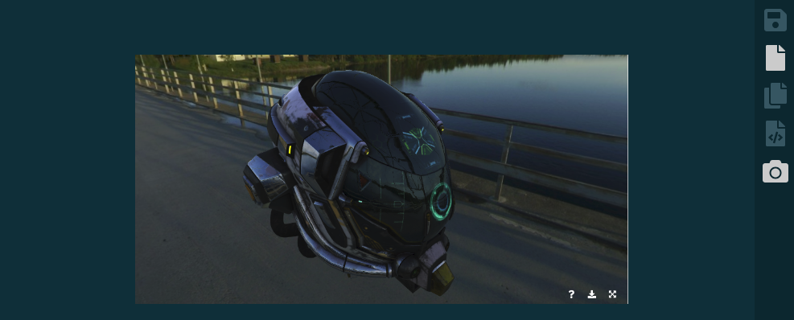

# vue-hastebin

Simple pastebin with image uploading

### Compiles for production
```
yarn install
yarn run build

cd server
yarn install
yarn run serve # Server on 0.0.0.0:5000
```

### Screenshots

image upload



code sharing

